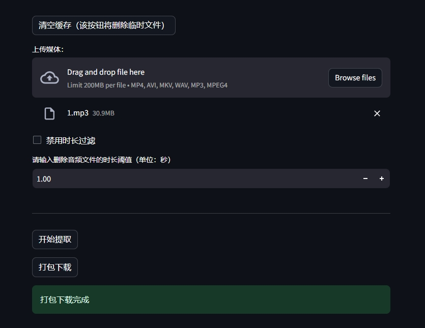

# speaker diarization

改工具用于提取音频或视频中不同说话人的音频，主要是为了方便获取音频训练的数据。

该工具的准确率不是百分百，但是能够将绝大多数对应角色音频正确区分，目前测试，在一个角色文件夹百多音频文件中，会有4~5个不匹配的，主要问题音频发生在两人声音叠加时。还有就是讲话人越多则准确率越低

## 环境

1. 安装Pytorch及其核心依赖，若已安装则跳过。参考自: https://pytorch.org/get-started/locally/
```bash
pip install torch torchvision torchaudio --index-url https://download.pytorch.org/whl/cu118
```
2. 识别工具[pyannote.audio](https://github.com/pyannote/pyannote-audio)
    ```bash
    pip install pyannote.audio
    ```
    
    去下列链接里面去同意它的用户条件：
    * [pyannote/segmentation-3.0](https://hf.co/pyannote/segmentation-3.0)
    * [pyannote/speaker-diarization-3.1](https://hf.co/pyannote/speaker-diarization-3.1)
    
    

    获取[hf令牌](hf.co/settings/tokens)，之后填入`.env`配置文件中去。

3. 安装依赖包
    ```bash
    # 语音清洁
    pip install audio-separator[gpu]
    # 其他环境
    pip install -r requirements.txt
    ```
    
4. 安装 ffmpeg
    * ubuntu
        ```bash
        sudo apt install ffmpeg
        ```
    * windows
        下载个[exe](https://ffmpeg.org/)后添加到环境变量中

5. 创建配置文件'.env'
    ```text

    uvr5_model_filename = "UVR_MDXNET_Main.onnx"
    weight_uvr5_root="./uvr5_weights"
    hf_token=""

    # 弃用，如果想要更好的分割效果可以尝试修改这些参数
    # segmentation_onset = 0.767
    # segmentation_offset = 0.713
    # segmentation_min_duration_on = 0.181
    # segmentation_min_duration_off = 0.501
    ```

## 使用


### 命令行

* run 运行角色语音提取
* -i 输入音频或者视频，可以是本地文件或者url链接
* -o 输出目录

```bash
CUDA_VISIBLE_DEVICES=1
python client.py run -i C:\\Users\\lisse\\Desktop\\400.mp4 -o ./temp/output 
```

最终文件将输出格式如下

```text
output
    └───1_(Vocals)_UVR_MDXNET_Main
        │
        ├───SPEAKER_00
        ├───SPEAKER_01
        ├───SPEAKER_02
        │       SPEAKER_02_284712_285775.wav
        │       SPEAKER_02_1347280_1347904.wav
        ├───result.rttm
```

提取音频中有一些过短的音频，可以通过下列方式过滤掉：

* filter 过滤指定文件夹中音频
* -d 音频文件所在目录
* -t 音频时长阈值(秒)
```bash
python client.py filter -d './temp/output/1_(Vocals)_UVR-MDX-NET-Inst_HQ_4/SPEAKER_05' -t 1.0
```

### web

* --server.maxUploadSize 设置上传文件的大小，默认是100M

```bash
streamlit run gui.py --server.port 1234 --server.maxUploadSize 1000
```

